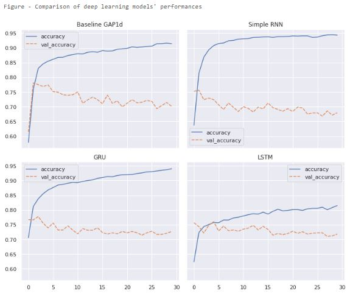

# Disaster Tweet Analysis Project with Natural Language Processing
## Deep Learning Project

  

[Video presentation](https://share.vidyard.com/watch/SEC1wKrr5MAsMP7wyR34Z4?)

## Table of contents
* [Background](#background)
* [Project](#project)
* [Pipeline](#pipeline)
* [Deliverables](#deliverables)
* [Model performances](#modelperformances)
* [Technologies](#technologies)
* [Getting Started](#getting-started)
* [License](#license)
* [Author](#author)

## Background

Twitter has been a key communication channel in times of emergency. The smartphones allows to announce an emergency being observed in real-time. Therefore, it serves a very useful tool for the agencies interested in programatically monitoring Twitter. Some efforts include the applications developed by disaster relief organizations and news agencies.

## Project 🎯

It’s not always clear whether a person’s words are actually announcing a disaster or not. The goal is to build a machine learning model that predicts which Tweets talks about real disasters and which ones do not. 

This dataset was created by the company figure-eight and originally shared on their ‘Data For Everyone’s [website]("https://www.figure-eight.com/data-for-everyone/"). They hand-classified a dataset of 10,000 tweets. The dataset may contain text that may be considered as profane, vulgar, or offensive.

*Bloc 4 - Jedha Fullstack Datascientist Bootcamp* 

## Pipeline  


## Deliverables

A submission file 📬 is provided after using fitted deeplearning model on a seperate dataset including tweet texts. The submission file can be found in docs/.

* L4_Disaster_analysis_with_Tweets_LI - a notebook explaining the procedure of training four deep learning models  
* models/model_final.7z - a trained deep learning model  
* docs/submission.csv - a submission file predicting whether a set of tweets talk about real disaster or not

## Model Performances  

Summary of machine learning model performances are shown below:  



* **Baseline GAP1d** has validation above 0.75 up to 10 epochs and then it starts to overfit on the train data.  
* **Simple RNN model** continously learns but results in important overfitting.  
* **GRU model** learns well and scores between 0.70 and 0.75 on the test data. It overfits quickly.  
* **LSTM model** learns much less than others. The rate of overfit is not much. The scores on test set are between 0.70 and 0.75.  

There is a fifty-fifty chance of guessing whether a tweet talks about disaster or not. All the models seem to increase the precitions relative to this dumb model. Overfitting is common. **GAP1d model** is chosen as the final in this project.  

## Technologies

Project is created with:
* Python 3.8
* Jupyter Notebook 6.4.12
* Python libraries (see /requirements.txt)
* VSCode

or this github project can be launched on [colab-google](https://colab.research.google.com) without any local installations. It is free and requires Google account sign-in.  

## Getting Started

To run this project, 
1. Clone the repo:
   ```sh
   git clone https://github.com/levist7/Disaster_Tweet_Analysis_NLP_DeepLearning.git
   ```
2. Install [packages](#technologies)

3. Install python libraries
   ```sh
   pip3 install -r requirements.txt
   ```

## License

Distributed under the MIT License. See LICENSE.txt for more information.

## Author  

* [levist7](https://github.com/levist7)  
